<p align="center">
  
</p>

<h1 align="center">🌉 BaSyx OPC UA Bridge</h1>

<p align="center">
  <strong>From Connected to Synchronized — The Synaptic Bridge for Industry 4.0</strong>
</p>

<p align="center">
  <a href="#-what-is-this"></a>
  <a href="#-quick-start"></a>
  <a href="#-for-developers"></a>
</p>

<p align="center">
  
  
  
  
  
</p>

---

## 🤔 What Is This?

**Imagine a factory.** Thousands of machines are running, each with sensors measuring temperature, speed, pressure. This data lives inside the machines, locked in a proprietary language called **OPC UA**.

Now imagine you need this data in your **Digital Twin** – a virtual copy of your factory that you can monitor, analyze, and optimize from anywhere in the world. But your Digital Twin speaks a different language: the **Asset Administration Shell (AAS)**.

**The BaSyx OPC UA Bridge is the translator.** It sits between your machines and your Digital Twin, listening to every change on the factory floor and instantly updating your digital world – and vice versa.

<p align="center">
  
</p>

### 🎯 In Simple Terms

| You Have | You Want | This Bridge Does |
|----------|----------|------------------|
| 🏭 Machines with OPC UA sensors | 🌐 A live Digital Twin (AAS) | ✅ Syncs data in <100ms |
| 📊 Data locked in factory protocols | 📱 Accessible data anywhere | ✅ Translates OPC UA ↔ AAS |
| ⚙️ Manual monitoring | 🤖 Automated control loops | ✅ Bidirectional writes |

---

## ⚡ Quick Start

### Prerequisites

- Python 3.11+
- An OPC UA server (or use our simulator for testing)

### 1. Clone & Setup

```bash
git clone https://github.com/hadijannat/basyx-opcua-bridge.git
cd basyx-opcua-bridge
./scripts/setup_dev.sh
```

### 2. Configure Your Bridge

Edit `config/bridge.yaml`:

```yaml
opcua:
  endpoints:
    - url: opc.tcp://your-plc:4840  # Your OPC UA server
      name: production-line-1

mappings:
  - opcua_node_id: "ns=2;s=Temperature"  # OPC UA node
    aas_id_short: Temperature             # AAS property name
    submodel_id: "urn:factory:submodel:sensors"
    value_type: xs:double

aas:
  type: basyx                         # basyx | aasx-server | memory
  url: http://localhost:8080/api/v3.0 # AAS REST base URL (bridge appends /aas if missing)
  enable_events: true                 # enable AAS→OPC UA control loop (polling or MQTT)
  encode_identifiers: true            # base64url encode submodel IDs for REST paths
```

For BaSyx/AASX servers, set `url` to the AAS REST v3 base (e.g., `/api/v3.0` or `/api/v3.0/aas`). Control is polling-based; tune
`poll_interval_seconds` if needed. You can also enable `auto_create_submodels`/`auto_create_elements` in the same
section to let the bridge create missing items on first sync.

### 3. Run the Bridge

```bash
python -m basyx_opcua_bridge.cli.main --config config/bridge.yaml
```

🎉 **That's it!** Your OPC UA data is now live in your AAS.

---

## 🧭 Auto‑Discovery & Bootstrap (No Manual Mapping)

Generate a ready‑to‑run config straight from an OPC UA endpoint:

```bash
python -m basyx_opcua_bridge.cli.main discover \
  --opcua opc.tcp://localhost:4840 \
  --out config/bridge.generated.yaml \
  --report docs/discovery.report.json \
  --emit-aas-env docs/aas.env.json \
  --include "Temperature|Speed" \
  --group namespace
```

If the server exposes the OPC 30270 (I4AAS) model, use `--group i4aas` to group by Submodel‑like nodes.

Provision the AAS server (create submodels/elements) and optionally start the bridge:

```bash
python -m basyx_opcua_bridge.cli.main bootstrap \
  --opcua opc.tcp://localhost:4840 \
  --aas-type basyx \
  --aas-url http://localhost:8080/api/v3.0 \
  --provision \
  --run
```

The discovery report includes node → AAS decisions, inferred types, and confidence scores.

### Event‑Driven AAS → OPC UA (MQTT)

Polling is the default fallback. To enable event‑driven writes, configure MQTT events:

```yaml
aas:
  events:
    enabled: true
    mqtt_url: mqtt://localhost:1883
    mqtt_topic: sm-repository/+/submodels/+/submodelElements/#
    payload_id_short_key: idShort
    payload_submodel_id_key: submodelId
    payload_value_key: value
    dedup_ttl_seconds: 2.0
    dedup_max_entries: 2048
```

The bridge accepts JSON payloads with `idShort` (or `idShortPath` for nested elements), optional
`submodelId`, and `value`. Payloads may also be wrapped in `data`, `payload`, or `event`.
If the payload is value-only, the bridge derives `submodelId` and `idShortPath` from BaSyx MQTT
topics (base64url submodel IDs).

`dedup_ttl_seconds` enables loop prevention by ignoring MQTT events that match recent writes from
the bridge (value hash + TTL).

Example MQTT payload:

```json
{
  "idShortPath": "Sensors/Temperature",
  "submodelId": "urn:factory:submodel:sensors",
  "value": 55.0
}
```

---

## 🎬 Visual Demo (Live Flow)


### Real Runtime Output (Captured)

<p align="center">
  
</p>

---

## 🏗️ Architecture

```mermaid
graph LR
    subgraph Factory Floor
        PLC[🏭 OPC UA Server]
    end
    
    subgraph BaSyx Bridge
        CP[Connection Pool]
        ME[Mapping Engine]
        SM[Sync Manager]
    end
    
    subgraph Digital World
        AAS[🌐 Asset Administration Shell]
    end
    
    PLC -->|Subscribe| CP
    CP --> ME
    ME --> SM
    SM -->|Update| AAS
    AAS -->|Control| SM
    SM --> ME
    ME --> CP
    CP -->|Write| PLC
```



### Core Components

| Component | Purpose |
|-----------|---------|
| **Connection Pool** | Manages resilient OPC UA connections with auto-reconnect |
| **Mapping Engine** | Transforms OPC UA types ↔ AAS XSD types (OPC 30270 compliant) |
| **Sync Manager** | Orchestrates bidirectional synchronization |
| **Monitor** | Subscribes to OPC UA changes, pushes to AAS |
| **Controller** | Receives AAS writes, validates & pushes to OPC UA |

---

## 👨‍💻 For Developers

### Project Structure

```
src/basyx_opcua_bridge/
├── core/           # Bridge orchestrator, connection pool, exceptions
├── config/         # Pydantic configuration models
├── mapping/        # Type conversion, semantic mapping (I4AAS)
├── sync/           # Monitor (OPC→AAS), Controller (AAS→OPC)
├── security/       # X.509 certificates, audit logging
├── observability/  # Prometheus metrics
└── cli/            # Typer CLI application
```

### Key Design Decisions

1. **Async-First**: Built on `asyncio` and `asyncua` for high concurrency (10,000+ subscriptions)
2. **Type-Safe Mapping**: Strict OPC 30270 compliance for OPC UA Variant ↔ XSD type conversion
3. **Validated Writes**: Range constraints prevent invalid data from reaching your PLCs
4. **Audit Trail**: Every write is logged with user identity, before/after values

### Running Tests

```bash
# All tests
pytest tests/

# With coverage
pytest tests/ --cov=src --cov-report=html

# Integration tests only
pytest tests/integration/
```

### Type Checking & Linting

```bash
ruff check src/      # Linting
mypy src/            # Type checking
```

### AAS API Compatibility Check

```bash
python scripts/validate_aas_openapi.py
```

This script validates core AAS REST endpoints and schema compliance against the IDTA OpenAPI specs.

---

## 📊 Compliance & Standards

| Standard | Status | Description |
|----------|--------|-------------|
| **OPC 30270 (I4AAS)** | ✅ Full | OPC UA Information Model for AAS |
| **OPC UA Part 14** | ✅ Partial | PubSub for efficient data distribution |
| **AAS Part 1 & 2** | ✅ Full | Metamodel and API compatibility |
| **BaSyx SDK 2.0** | ✅ Native | First-class integration |

---

## 🔒 Security

- **X.509 Certificates**: Full support for encrypted OPC UA connections
- **Security Policies**: Basic128Rsa15 through Aes256_Sha256_RsaPss
- **Audit Logging**: JSON-formatted audit trail for all write operations
- **Identity Propagation**: User context flows from AAS to OPC UA writes

---

## 📈 Observability

- **Prometheus Metrics**: Sync events, latency histograms, active subscriptions
- **Structured Logging**: JSON logs via `structlog`
- **Health Endpoints**: Kubernetes-ready liveness/readiness probes

---

## 🐳 Deployment

### Docker

```bash
docker build -t basyx-opcua-bridge -f docker/Dockerfile .
docker run -v $(pwd)/config:/app/config basyx-opcua-bridge
```

### Kubernetes

See `examples/kubernetes/` for production-ready deployment manifests.

---

## 🤝 Contributing

We welcome contributions! Please see [CONTRIBUTING.md](CONTRIBUTING.md) for guidelines.

---

## 📜 License

Apache License 2.0 - See [LICENSE](LICENSE) for details.

---

<p align="center">
  <strong>Built with ❤️ for Industry 4.0</strong><br/>
  <sub>Part of the <a href="https://eclipse.dev/basyx/">Eclipse BaSyx</a> ecosystem</sub>
</p>
